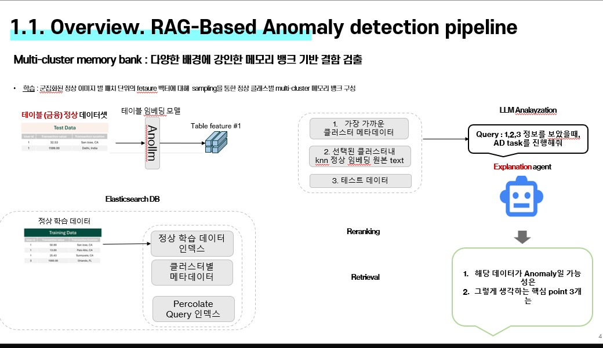
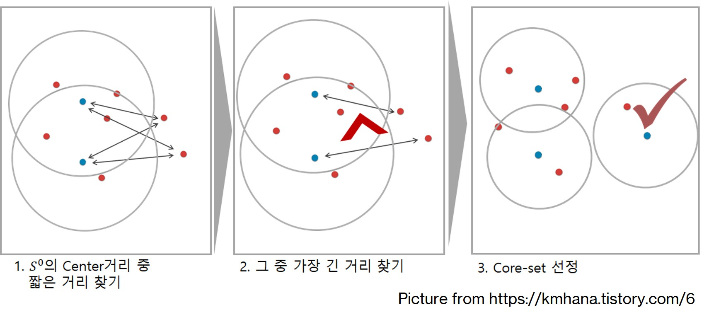
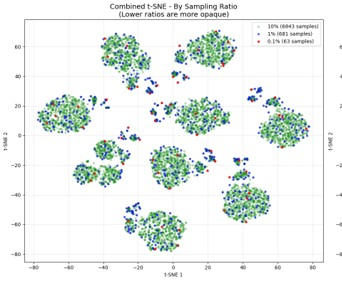
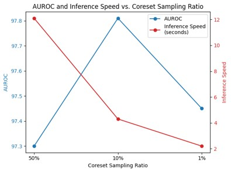
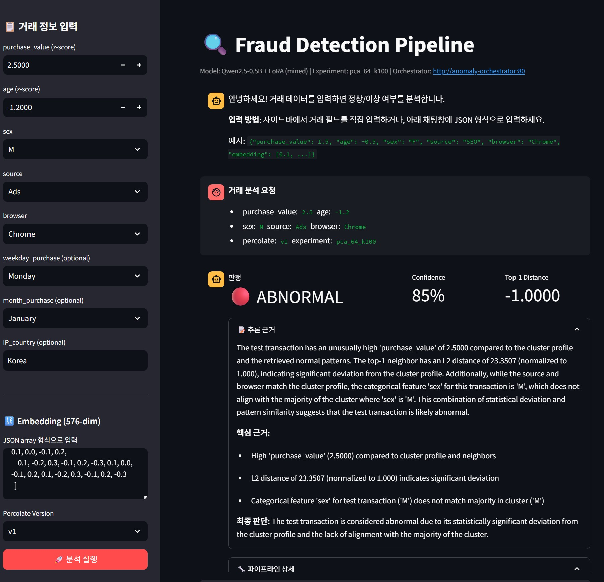

# Fraud Detection RAG Pipeline

<p align="center">
  
  
  
  
</p>

## 📌 프로젝트 개요 (Project Overview)

**금융/반도체 이상 탐지를 위한 RAG(Retrieval-Augmented Generation) 파이프라인**

Tabular 데이터에서 이상 거래를 탐지하고 원인을 설명하는 엔드투엔드 시스템입니다. 
Elasticsearch 기반 Two-Stage Retrieval과 경량 LLM Analyzer를 결합하여, 검색 및 이상탐지 성능 목표를 개선하고자 하였습니다.

## 🎯 To be Updated..

- [ ] 코드 정리 (llm analyzer training colab, gke elasticsearch node, 전체적인 주석 및 불필요한 코드 정리)
- [ ] 전체 파이프라인 설명 picture update 예정
- [ ] Locust 부하테스트 report 이미지 update 예정
- [ ] Data mining 관련 통계 update 예정
- [ ] LLM analyzer streamlit GRPO 적용 전 (SFT only) 예시라, 적용 유무 비교 이미지 update 예정
- [ ] ## 🚀 실행 가이드 (Quick Start) update 예정 

### 🎯 핵심 문제 해결

| 문제 | 해결 방안 | 성과 |
|------|---------|------|
| 벡터 검색 병목 | Cluster-Based Two-Stage Retrieval | Router Recall@5 9% ↑, Latency P99 25% ↓ |
| 메모리 제약 | Coreset Sampling (10%) | AUROC 0.4%↓ <-> 메모리 89% ↓ (2.8GB → 0.31GB) 검증 |
| CPU Node에서 LLM Analayzer 추론 제약 | 지식 증류 (7B → 0.5B) | Inference time 2.5배 ↑ |
| 파이프라인 오류 학습 부족 | Pipeline-Aware Hard Negative Mining | AUROC 2.3% ↑ |
| Confidence 과신 문제 | GRPO 강화학습 (4-axis reward) | ECE 8% ↓ |

---

## 🏗️ 시스템 아키텍처 (Architecture)

파이프라인 overview picture 업로드 예정..
<!--  -->

### 파이프라인 흐름

```text
Test Transaction
      ↓
[Router] Percolate Query → Cluster Matching (최근접 클러스터 필터링)
      ↓
[Retriever] Filtered KNN → Top-5 Normal Vectors (클러스터 내 검색)
      ↓
[Analyzer] Distance Scoring + LLM Reasoning → 이상 판단 + 원인 설명
      ↓
[Orchestrator] Final Output → API Response
```

---

## 🔬 핵심 기술 (Core Technologies)

### 1️⃣ Percolate Query-based Cluster Routing

최근접 정상 클러스터의 매칭 정확도 및 검색 속도 개선을 위해, 라우팅 쿼리를 **3단계에 걸쳐 고도화**시켰습니다.

---

#### **Version 1: Strict AND**

Decision Tree의 리프 노드 경로를 `bool.filter`로 직접 변환하여 정밀 매칭합니다.

```python
# 예시: feature v1 ∈ [0.8, ∞) AND v3 ∈ [-1.2, ∞) → Cluster 63
{
  "query": {
    "bool": {
      "filter": [
        {"range": {"v1": {"gte": 0.8}}},
        {"range": {"v3": {"gte": -1.2}}}
      ]
    }
  }
}
```

- **의도**: Decision tree의 leaf 정보를 각 클러스터의 rules로 표현하고, 이를 직관적으로 percolate query로 매칭 
- **한계**: Strict AND 다수 결합으로 인해, Top-5 클러스터 매칭의 다양성이 떨어짐 (같은 1개의 클러스터만 매칭)

---

#### **Version 2: Hybrid Diversity**

Version1의 매칭 클러스터에서, 최근접 정상 클러스터 4개를 최소 벡터 거리로 보완(Top-4)하여 결합합니다.

```python
# 1. Phase 1으로 Top-1 클러스터 확보
# 2. 벡터 거리(L2)로 Top-4 보완
candidates = [top_1_rule_match] + sorted(centroids, key=lambda x: l2(vec, x))[:4]
```

- **의도**: Recall@5 및 Top-5 매칭 다양성 ↑
- **한계**: Strict AND에 비해 검색 지연 ↑

---

#### **Version 3: Optimized Bucketization**

V1 및 V2의 Range 연산을 **Term Matching**으로 전환하여 Pruning 성능 극대화.

```python
# 수치를 버킷으로 치환 + ±1 Tolerance로 경계값 오차 흡수
{
  "query": {
    "bool": {
      "must": [
        {
          "bool": {
            "should": [
              {"term": {"v1_direction": "lte"}},
              {"terms": {"v1_bucket": [6, 7, 8]}}  # ±1 Tolerance
            ],
            "minimum_should_match": 1,
            "boost": 2.0
          }
        },
        {
          "percolate": {
            "field": "query",
            "document": {"v1": 0.05, "v3": -1.1}
          }
        }
      ]
    }
  }
}
```
- **의도**: 후보군 97% 제거 (5,760개 → ~150개), 부동소수점 비교 → Bitset 연산으로 전환
- **한계**: Percolate query index ↑ 및 rules 수가 늘어났을때의 검색 지연 가능성

---

#### 📊 실험 결과 (Percoalte query routing)

Percolate query version에 따른 클러스터 정확도, 리콜, 단건 검색 지연 시간 및 AUROC 지표를 비교합니다.

| query version | Cluster acc / Recall@5 (Router) | Router MRR | Latency p99 (ms) |  Recall@5 (knn) / AUROC |
| :--- | :---: | :---: | :---: | :---: |
| **Strict AND (v1)** | 0.816 / 0.816 | 0.941 | 420.25 | 0.786 / 0.8726 |
| **V1 + aug** | **0.823 / 0.905** | **1.00** | 430.01 | **0.956 / 0.9125** |
| **V1 + aug + bucket** | 0.823 / 0.897 | 0.988 | **409.25** | 0.956 / 0.9037 |

---

### 2️⃣ Filtered KNN (Coreset Sampling 검증)
Coreset Sampling 최적 운영점 검증: 메모리-이상탐지 성능-검색 latency trade-off 분석을 통해, coreset sampling 비율 10%의 최적점을 도출하고자 하였습니다.

<table>
<tr>
<td width="50%" align="center">



**Coreset Sampling Algorithm**<br>[(from https://kmhana.tistory.com/6)](https://kmhana.tistory.com/6)

</td>
<td width="50%" align="center">



**Cluster Distribution with coreset sampling ratio**<br>(t-SNE)

</td>
</tr>
</table>

#### 📊 실험 결과 (Coreset Sampling 검증)

**Croreset Sampling 비율 vs AUROC vs 검색 지연**

| Coreset % | Index Size (GB) | Docs Count | AUROC | Recall@5 (knn) | Median Latency (ms) |
| :---: | :---: | :---: | :---: | :---: | :---: |
| 100 | 2.8 | 140,128 | 0.956 | **0.956** | 125 |
| **10** | 0.31 | 14,012 | **0.952** | 0.947 | 68 |
| 1 | 0.035 | 1,401 | 0.901 | 0.882 | **52** |

<table>
<tr>
<td width="50%" valign="top">

**Coreset Sampling 유무에 따른 Page Faults 발생 정도**<br>
*(Memory 2GB로 Node 제한 시)*

| Index sharding | 100% Index<br>(Page Faults/sec) | 10% Index<br>(Page Faults/sec) |
| :---: | :---: | :---: |
| **X** | 45.2 | 38.7 |
| **O** | 52.3 | **8.1** |

</td>
<td width="50%" valign="top" align="center">


<p align="center"><i>AUROC and Inference Speed vs. Coreset Sampling Ratio</i></p>

</td>
</tr>
</table>

<br>

---

### 3️⃣ Pipeline-aware data mining & LLM Analyzer 경량화 및 GRPO 최적화
Router 오류(type1), Cross-cluster 오류(type2), Distance boundary(type3) 3가지 타입 구조화된 실패 케이스 mining 및 6-axis reward function을 통해, LLM Analyzer의 AUROC +2.3%p 향상 및 confidence calibration(ECE 0.15→0.08) 개선을 도출하고자 하였습니다.

**Pipeline-Aware Hard Negative Mining (3가지 유형)**
```python
# Type 1: Router Misrouting (28% 발생)
#   → gt_cluster_id ≠ predicted_cluster

# Type 2: Cross-Cluster Retrieval (55% 발생)
#   → 라우팅 정확하나 HNSW 경계에서 타 클러스터 이웃 혼입

# Type 3: Distance Band (15% 발생)
#   → top1_distance ∈ [P75, P90], moderate/distant 경계

```

**Knowledge Distillation (Qwen2.5-7B → 0.5B) 및 GRPO 강화학습 (Group Relative Policy Optimization)**
```python
# 4축 보상 함수 (그룹 내 상대 비교)
Reward = 0.40 × Accuracy          # Binary 판정
       + 0.30 × Calibration       # |confidence - actual| 최소화
       + 0.20 × Coherence         # 20-80 단어, 논리 일관성
       + 0.10 × Factuality        # Evidence 근거 사실성

Advantage = (reward - group_mean) / group_std  # 같은 hard negative type 내
Policy_loss = -advantage × log_prob + KL_penalty
```

#### 📊 실험 결과 (Data mining 및 LLM Analyzer 최적화)

**LLM Analyzer Interface (Streamlit)**



<br>

**Data mining 및 GRPO 적용 유무에 따른 LLM Analyzer 이상 판단 성능**

| Data Type | Training | AUROC | ECE ↓ | Judge ↑ |
|:---|:---:|:---:|:---:|:---:|
| **Distance-based** | SFT | 0.820 | 0.15 | 6.5/10 |
| **Mining-based** | SFT | 0.850 | 0.12 | 7.0/10 |
| **Distance-based** | GRPO | 0.840 | 0.08 | 7.2/10 |
| **Mining-based** | GRPO | **0.873** | **0.08** | **7.5/10** |

- **ECE (Expected Calibration Error)**: Confidence calibration 지표, 낮을수록 우수 (Teacher prompt 개선 + GRPO calibration reward)
- **Judge**: HuggingFace-based reasoning quality 평가 (Relevance, Consistency, Specificity), 10점 만점


## 💻 기술 스택 (Technology Stack)

**Infrastructure & Deployment**
- **Orchestration**: Kubernetes (GKE), Helm
- **Monitoring**: Prometheus, Grafana

**Data & Search**
- **Search Engine**: Elasticsearch 8.x (ECK)
- **Vector DB**: HNSW Index (Elasticsearch)
- **Data Processing**: PySpark, Pandas

**ML & AI**
- **Framework**: PyTorch, Transformers (Hugging Face)
- **LLM**: Qwen2.5-0.5B-Instruct (LoRA fine-tuned)
- **Teacher Model**: Gemini-flash-2.5-lite, Qwen2.5-7B
- **Training**: SFT (Supervised Fine-Tuning), GRPO (RL)

**Backend & API**
- **Framework**: FastAPI 0.115
- **Async**: asyncio, aiohttp
- **Validation**: Pydantic

**Cloud & Storage**
- **Platform**: Google Cloud Platform
- **Storage**: Google Cloud Storage (GCS)
- **Registry**: Artifact Registry, Container Registry

--- 

## 🚀 실행 가이드 (Quick Start)

### Prerequisites
```bash
# 필수 도구 설치
- kubectl (1.28+)
- gcloud CLI
- Docker
- Python 3.10+
```

### 1️⃣ Elasticsearch 배포 (ECK)
```bash
# Elasticsearch Operator 설치
kubectl apply -f https://download.elastic.co/downloads/eck/2.9.0/crds.yaml
kubectl apply -f https://download.elastic.co/downloads/eck/2.9.0/operator.yaml

# Elasticsearch Cluster 배포
kubectl apply -f k8s/elasticsearch-cluster.yaml

# 인덱스 생성
python scripts/create_index.py --experiment-case pca_64_k100
```

### 2️⃣ Microservices 배포
```bash
# ConfigMap 적용 (환경 변수)
kubectl apply -f k8s/00-anomaly-config.yaml

# 각 서비스 배포
kubectl apply -f k8s/02-router.yaml
kubectl apply -f k8s/03-retriever.yaml
kubectl apply -f k8s/04-local-analyzer.yaml
kubectl apply -f k8s/05-orchestrator.yaml
```

### 3️⃣ 추론 실행
```bash
# Batch Inference (평가용)
python batch_inference.py \
  --experiment-case pca_64_k100 \
  --percolate-version v14 \
  --coreset-percentage 10

# API 호출 (실시간)
curl -X POST http://localhost:8000/analyze \
  -H "Content-Type: application/json" \
  -d '{
    "purchase_value": 32.53,
    "source": "SEO",
    "browser": "Chrome",
    "sex": "M",
    "age": 25
  }'
```

## 🔧 개발 환경 설정 (Development)

```bash
# 1. 가상환경 생성
python -m venv venv
source venv/bin/activate  # Windows: venv\Scripts\activate

# 2. 의존성 설치
pip install -r requirements.txt

# 3. 환경 변수 설정
cp .env.example .env
# .env 파일에 GCP_PROJECT, ES_HOST 등 설정

# 4. 로컬 테스트
pytest tests/
```
--- -->

## 📁 프로젝트 구조 (Directory Structure)

```text
fraudecom_v3/
├── apps/
│   ├── ingest_tree_pipeline.py   # Elasticsearch Data ingestion
│   ├── router/                   # Percolate Query 기반 클러스터 라우팅
│   ├── retriever/                # Coreset Sampling + HNSW KNN
│   ├── analyzer/                 # LLM 기반 이상 판단 + 원인 설명
│   └── orchestrator/             # 전체 워크플로우 제어

├── k8s/
│   ├── elasticsearch/            # ECK 배포 설정
│   ├── router-deployment.yaml
│   ├── retriever-deployment.yaml
│   └── analyzer-deployment.yaml
├── evaluation/
│   ├── batch_inference.py        # 평가용 배치 추론
│   └── evaluation_metrics.py
│   └── hard_negative_miner.py    # Hard Negative Mining
└── README.md
```
---

## 📚 참조 (References)

**학술 논문**
- [WaferDC: Multi-cluster Memory Bank](https://github.com/SpatialAILab/WaferDC)
- [AnoLLM: Large Language Models for Tabular Anomaly Detection](https://github.com/amazon-science/AnoLLM-large-language-models-for-tabular-anomaly-detection)
- [GRPO: Group Relative Policy Optimization](https://arxiv.org/pdf/2402.03300)

**기술 문서**
- [Elasticsearch Percolate Query](https://www.elastic.co/guide/en/elasticsearch/reference/current/query-dsl-percolate-query.html)
- [GKE RAG pipeline](https://docs.cloud.google.com/kubernetes-engine/docs/tutorials/build-rag-chatbot?hl=ko)